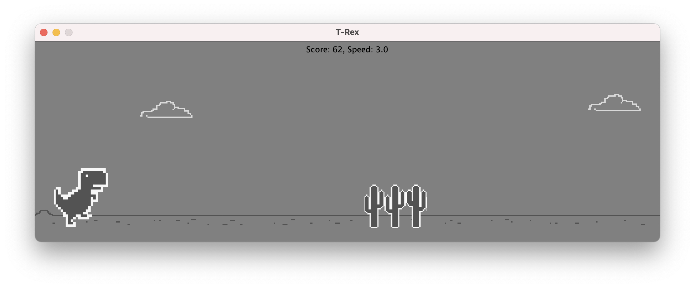

# T-Rex

## Screenshots

## Links

#### From the task

* [SOLID](
  https://howtodoinjava.com/best-practices/solid-principles/
  ) principles.
* [Exceptions handling](
  https://howtodoinjava.com/best-practices/java-exception-handling-best-practices/
  ) best practices.
* Java [modules](
  https://www.oracle.com/corporate/features/understanding-java-9-modules.html
  ).
* Google [code style](
  https://google.github.io/styleguide/javaguide.html
  ).
* README.md
    * Make a [readme](https://www.makeareadme.com) 101.
    * An [article](
      https://medium.com/@saumya.ranjan/how-to-write-a-readme-md-file-markdown-file-20cb7cbcd6f
      ).
    * A [beginners guide](
      https://meakaakka.medium.com/a-beginners-guide-to-writing-a-kickass-readme-7ac01da88ab3
      ) to write a REAEDME.
      * 🔥 [RDD](
        https://tom.preston-werner.com/2010/08/23/readme-driven-development.html
        ) - Readme Driven Development. 🔥
      * RDD article [discussion](https://news.ycombinator.com/item?id=1627246).
* [Git-wiki](
  https://www.perforce.com/blog/vcs/how-choose-right-git-powered-wiki-your-team
  ).
